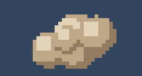
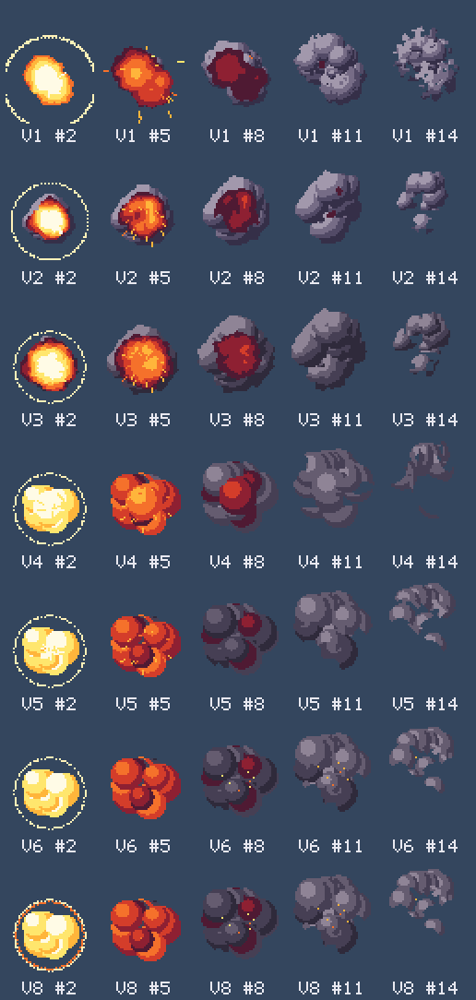

# sulfurchi-skills

一个 Claude Code 技能合集。目前收录两个技能，都在插件 `pixel-art` 里：

| 技能 | 用途 |
|---|---|
| `pixel-art-by-code` | 用代码画像素画：角色、表情差分、图标、小动画 |
| `pixel-fx-by-code` | 用代码做像素特效：爆炸、烟雾、魔法、受击火花 |

## pixel-art-by-code：用代码画像素画


模型只能输出文字，但仍然可以画像素画。做法是把“画”拆成两半：

- **用文字写出像素**：小部件写成字符画，大形体写成几何指令；配色、打光、描边、抖动交给算法统一完成。
- **看图检查结果**：渲染成 PNG，放大、拼成联系表后看图；不能读图时，把图打印回字符来看。

两半接成一个闭环：发现具体问题，改几个数字，再渲染，直到满意。上面的角色 Pip，以及它的表情差分和待机动画，就是用这个技能的示例脚本生成的。

技能内容包括：

| 文件 | 内容 |
|---|---|
| `SKILL.md` | 工作流程：定规格 → 在格子上规划 → 写像素 → 差分参数化 → 看图迭代 → 动画 → 交付 |
| `scripts/pixel.js` | 零依赖的 Node 工具：绘图原语、字符画、打光与描边、Bayer 抖动、PNG 读写、联系表、字符查看、GIF、参考图像素化 |
| `scripts/example_character.js` | 完整示例，也可以作为新角色的模板 |
| `references/` | 手艺细则（含五官和特效的字符画库）、动画时序与公式、参考图转换、实战案例 |

## pixel-fx-by-code：用代码做像素特效





特效不逐帧画，而是模拟出来的：

- **写规则**：把特效拆成烟团、火花、冲击波、闪光、余烬几种元素，写出它们怎么生成、怎么运动、怎么随时间冷却变色。
- **算每一帧**：每个烟团画成像素画风格的平涂圆，按自己的热度从短调色板里取色，分层渲染、清理。
- **先看数字，再看图**：每帧的覆盖面积、贴边像素、孤点先排除一批问题；再看联系表、三种背景（暗、中、亮）和 1 倍大小。

这个技能是从一次实际制作中总结出来的。上面的爆炸前后改了 8 版，每一版改了什么、看到什么问题、为什么这么改，都记在 [`references/explosion-case.md`](plugins/pixel-art/skills/pixel-fx-by-code/references/explosion-case.md) 里。下图每一行是一个版本：



技能内容包括：

| 文件 | 内容 |
|---|---|
| `SKILL.md` | 工作流程：定规格 → 拆元素 → 运动 → 平涂圆着色 → 分层 → 消散 → 检查 → 导出；附“看到的问题 → 原因 → 怎么改”对照表 |
| `scripts/explosion.js` | 现成的生成器，4 个预设（爆炸、魔法、烟尘、受击），任意参数都能用 `--set` 在命令行修改 |
| `scripts/template.js` | 从零写一个特效的最小例子（不到 60 行），可以复制来改 |
| `scripts/fx.js` | 特效函数库：分层抽样、固定步长积分、平涂烟团、冲击波、清理、每帧数字、裁剪导出 |
| `scripts/pixel.js` | 与上一个技能相同的绘图库 |
| `references/` | 爆炸的完整迭代过程、全部参数与调参经验 |

每次生成都会输出：1 倍透明单帧、精灵表加 JSON（帧尺寸、时长、锚点）、GIF 预览，以及三张检查图。

### 安装

**方式一：Claude Code 插件（推荐）**

```bash
claude plugin marketplace add sulfurchi-art/claude-skills
```

```bash
claude plugin install pixel-art@sulfurchi-skills
```

装好后两个技能都可用。需要时 Claude 会自动选用，也可以用 `/pixel-art:pixel-art-by-code` 或 `/pixel-art:pixel-fx-by-code` 手动调用。

**方式二：直接复制技能文件夹**

把 `plugins/pixel-art/skills/` 下需要的技能文件夹复制到下面任一位置：
- `~/.claude/skills/`：个人使用，所有项目都生效；
- `<项目>/.claude/skills/`：只在这个项目里生效。

每个技能文件夹都自带一份 `pixel.js`，可以单独复制。

**方式三：给其他 agent 使用（Codex 等）**

把技能文件夹放进项目，在 `AGENTS.md` 里写一行：“画像素画或做像素特效之前，先读 `<路径>/SKILL.md`”。

运行环境：需要 Node.js 16 或以上版本，没有其他依赖。把 JPEG 参考图转成 PNG 时需要 ffmpeg，这一项可选。

### 快速体验

```bash
cd plugins/pixel-art/skills/pixel-art-by-code
node scripts/example_character.js out                    # 画出 Pip 全套：PNG、联系表、GIF
node scripts/pixel.js ascii out/pip_happy.png            # 把图打印成字符
node scripts/pixel.js help                               # 全部命令
```

```bash
cd plugins/pixel-art/skills/pixel-fx-by-code
node scripts/explosion.js out/boom                       # 爆炸：帧、精灵表、GIF、检查图
node scripts/explosion.js out/magic --preset magic       # 魔法爆发（还有 dust、hit）
node scripts/explosion.js out/x --seed 3 --set puffs.n=16   # 换种子、改参数
node scripts/template.js out/poof                        # 最小例子
```

### 目录结构

```
.claude-plugin/marketplace.json        插件市场清单
plugins/pixel-art/
  .claude-plugin/plugin.json           插件清单
  skills/pixel-art-by-code/
    SKILL.md
    scripts/pixel.js  example_character.js
    references/craft.md  animation.md  reference-images.md  case-study.md
  skills/pixel-fx-by-code/
    SKILL.md
    scripts/explosion.js  template.js  fx.js  pixel.js
    references/explosion-case.md  recipes.md  explosion-evolution.png
assets/                                README 中的预览图
```

维护时注意：两个技能里的 `pixel.js` 是同一个文件的两份拷贝，修改时两份要一起改。
